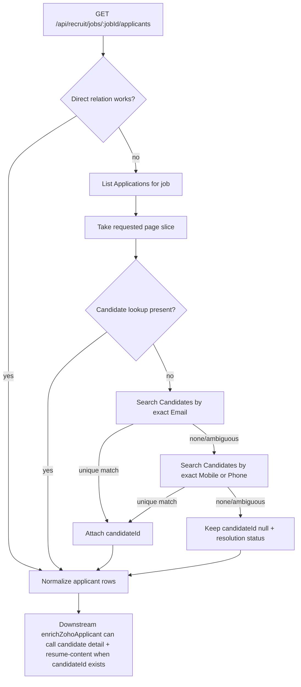

# fix: Restore candidate resolution in applications fallback

## Overview

The `JobOpenings/:id/Candidates` and `JobOpenings/:id/associate` relations are not reliable in this Zoho Recruit account, so the bridge already falls back to listing `Applications`. That fallback currently returns enrichment-dead applicant payloads because `candidateId` stays null, which prevents downstream candidate detail, resume download, and resume parsing flows from running. This plan restores a usable read contract for fallback applicants without changing write-side behavior.

## Problem Frame

Live smoke testing showed the resume parser itself works when given a real candidate/application pair, but the normal triage path cannot reach it from `/api/recruit/jobs/:jobId/applicants`.

The full causal chain is:

- `api/recruit/_shared.js` falls back from `JobOpenings/:id/Candidates` and `JobOpenings/:id/associate` to `/recruit/v2/Applications`.
- The fallback fetch requests raw application rows only, with no candidate-resolution step.
- In this live Zoho tenant, those application rows contain job/contact fields but do not carry a usable `Candidate`, `Candidate_Name`, or `Candidate_Id` lookup for the returned records.
- `api/recruit/_normalize.js` only fills `candidateId` from those lookup fields, so normalized fallback applicants leave `candidateId: null`.
- Downstream consumers treat `candidateId` as the bridge from applicant listing to candidate detail. In particular, `zoho-attio-recruit-triage` exits enrichment early with `missing_candidate_id`, so it never reaches `GET /api/recruit/candidates/:candidateId`, `/resume-content`, or local resume parsing.

This is a contract bug in the bridge fallback path, not a parser bug.

## Requirements Trace

- R1. `GET /api/recruit/jobs/:jobId/applicants` must remain usable when both direct applicant relations fail and the bridge falls back to `Applications`.
- R2. Fallback applicants must include a usable internal `candidateId` whenever the bridge can resolve a unique candidate match from exact application contact data.
- R3. Ambiguous or unresolvable fallback records must stay explicit and safe rather than guessing a candidate link.
- R4. Regression coverage must prove that fallback applicants can reach downstream resume enrichment again.
- R5. Public docs must describe the fallback contract and its dependency on exact contact data plus `ZohoRecruit.search.READ`.

## Scope Boundaries

- No Attio write-path changes.
- No changes to Zoho Recruit write-side endpoints.
- No fuzzy candidate matching by name alone.
- No tenant-specific field customization assumptions in the bridge contract.

### Deferred to Separate Tasks

- Downstream execution work in `zoho-attio-recruit-triage` if the team wants extra consumer-side smoke automation after the bridge contract is fixed.

## Context & Research

### Relevant Code and Patterns

- `api/recruit/_shared.js` owns Recruit fetches, retries, fallback decisions, and search helpers.
- `api/recruit/_normalize.js` defines the applicant contract consumed by downstream skills.
- `api/recruit/jobs/[jobId]/applicants.js` is the public read endpoint that assembles the normalized payload.
- `tests/job-applicants.test.js` already covers relation fallback, applicant normalization, and resume-content regressions.

### Institutional Learnings

- `docs/solutions/integration-issues/restore-zoho-recruit-bridge-readiness-on-vercel-and-add-applicants-fallback.md` documents why the account needs the `Applications` fallback at all, but it currently overstates fallback readiness because it does not cover `candidateId` loss.

### External References

- Zoho Recruit Get Records API documents optional `fields` selection for list retrieval and shows that lookup values are module-field dependent: https://www.zoho.com/recruit/developer-guide/apiv2/get-records.html
- Zoho Recruit Applications docs state every candidate has an associated application, but that does not guarantee the list API returns a candidate lookup in this tenant’s current layout/response shape: https://help.zoho.com/portal/en/kb/recruit/talent-management/applications/articles/applications-in-zoho-recruit
- Zoho Recruit Application customization docs show candidate/job fields in Applications are layout-driven/inherited, which is a strong signal that the bridge cannot safely assume those lookup fields will always be present in API list responses: https://help.zoho.com/portal/en/kb/recruit/talent-management/applications/articles/customizing-applications-in-zoho-recruit

## Key Technical Decisions

- Resolve fallback `candidateId` inside the bridge, not in downstream triage code.
  Rationale: the broken contract originates in the bridge endpoint, and downstream consumers already correctly expect `candidateId` to be part of applicant identity.

- Use exact candidate search by application contact data (`Email` first, then normalized `Mobile`/`Phone`) only for fallback rows that lack a candidate lookup.
  Rationale: live probing showed exact email and exact mobile searches both return the correct candidate in this tenant, while name-only lookup would be unsafe.

- Require a unique exact match before populating `candidateId`.
  Rationale: ambiguous candidate search results should not silently bind an application to the wrong candidate.

- Resolve only the paged fallback rows returned to the client, not every scanned application row used for pagination.
  Rationale: this keeps API volume bounded and avoids unnecessary search traffic while preserving current pagination behavior.

- Preserve unresolved records with explicit null `candidateId` and attach machine-readable resolution metadata.
  Rationale: consumers need to distinguish “unresolved safely” from “field omitted accidentally”.

## Open Questions

### Resolved During Planning

- Should the plan rely on `Applications?fields=Candidate...`?
  Resolution: no. Live probes on this tenant showed application records still lacked a usable candidate lookup, and the Applications layout is tenant-dependent.

- Is exact candidate search viable with current bridge scope?
  Resolution: yes. Live probes succeeded with exact `Email` and `Mobile` searches, and the deployed bridge already includes `ZohoRecruit.search.READ`.

### Deferred to Implementation

- Exact naming for the candidate-resolution metadata fields on the applicant payload.
  Why deferred: this is contract-shape detail best settled while editing the existing normalization code.

- Whether to cache candidate search results only within a request or promote them to a shared helper with broader reuse.
  Why deferred: the correct extraction boundary depends on the final shape of the helper during implementation.

## High-Level Technical Design

> *This illustrates the intended approach and is directional guidance for review, not implementation specification. The implementing agent should treat it as context, not code to reproduce.*

## Implementation Units

- [x] **Unit 1: Add exact-contact candidate resolution for fallback applicants**

**Goal:** Resolve internal `candidateId` values for paged fallback application rows using safe, exact candidate search.

**Requirements:** R1, R2, R3

**Dependencies:** None

**Files:**
- Modify: `api/recruit/_shared.js`
- Test: `tests/job-applicants.test.js`

**Approach:**
- Add a Recruit search helper for candidate lookup that uses existing request/error normalization.
- Resolve fallback rows only after pagination is determined, so search cost scales with returned rows rather than scan volume.
- Search exact email first when present, then exact mobile/phone when present.
- Accept only a unique exact candidate result; leave unresolved rows unchanged if the search returns zero or multiple candidates.
- Cache repeated exact-contact searches within the request so duplicate email/phone values do not cause duplicate API calls.

**Patterns to follow:**
- `api/recruit/_shared.js` `searchJobOpeningsByTitle`
- `api/recruit/_shared.js` request retry/error classification flow

**Test scenarios:**
- Happy path: fallback application row with exact email and no lookup fields resolves to the matching internal candidate id.
- Happy path: fallback application row with no email but exact mobile resolves to the matching internal candidate id.
- Edge case: two fallback rows sharing the same exact email reuse the cached search result and both receive the same candidate id.
- Error path: candidate search returns no results and the fallback row stays unresolved without failing the entire applicants response.
- Error path: candidate search returns multiple exact matches and the fallback row stays unresolved rather than guessing.
- Integration: direct relation failures followed by `Applications` fallback still return paged applicants successfully while enriching candidate ids for the returned page slice.

**Verification:**
- The fallback code path still returns applicant lists when direct relations fail.
- Returned fallback applicants include internal `candidateId` when Zoho candidate search finds a unique exact match.
- Search amplification remains bounded to returned rows plus cache misses.

- [x] **Unit 2: Expose resolution state in the normalized applicant contract**

**Goal:** Make fallback candidate-resolution outcomes visible in the normalized applicant payload so downstream consumers and operators can distinguish resolved, unresolved, and ambiguous cases.

**Requirements:** R2, R3

**Dependencies:** Unit 1

**Files:**
- Modify: `api/recruit/_normalize.js`
- Modify: `api/recruit/jobs/[jobId]/applicants.js`
- Test: `tests/job-applicants.test.js`

**Approach:**
- Extend applicant normalization so candidate resolution can carry both the resolved `candidateId` and a small status/source descriptor.
- Preserve existing `applicationId` behavior and current top-level applicant shape wherever possible to avoid unnecessary consumer churn.
- Thread the resolution metadata into `reviewPayload` so downstream consumers do not have to infer whether `candidateId: null` means “truly absent” or “lookup not attempted”.

**Patterns to follow:**
- `api/recruit/_normalize.js` `normalizeApplicantRecord`
- Existing `reviewPayload` enrichment conventions in candidate/application normalization

**Test scenarios:**
- Happy path: resolved fallback applicant exposes both `candidateId` and a resolution source/status in normalized output.
- Edge case: fallback applicant with native `Candidate` lookup keeps that id and is not overwritten by search-derived metadata.
- Error path: unresolved fallback applicant keeps `candidateId: null` and exposes a non-success resolution status.
- Integration: `/api/recruit/jobs/:jobId/applicants` response remains backward-compatible for existing fields while adding the new resolution metadata.

**Verification:**
- Consumers can tell whether a fallback row is ready for candidate enrichment without performing additional inference.
- Existing fields in the applicants response remain stable for current callers.

- [x] **Unit 3: Lock the bridge regression with end-to-end fallback enrichment coverage**

**Goal:** Prevent a recurrence where fallback applicants look “OK” in isolation but still cannot drive candidate-detail and resume flows.

**Requirements:** R4

**Dependencies:** Unit 1, Unit 2

**Files:**
- Modify: `tests/job-applicants.test.js`

**Approach:**
- Add a contract-style regression that starts with direct relation failure, exercises the `Applications` fallback, and asserts the normalized applicant output is enrichment-ready.
- Keep this test bridge-local rather than importing triage code, so the bridge owns its own public contract.
- Cover both the successful-resolution path and the explicit unresolved path.

**Execution note:** Start from a failing bridge-level contract test that asserts fallback applicants include a usable internal `candidateId` for exact-match records.

**Patterns to follow:**
- Existing mocked fetch coverage in `tests/job-applicants.test.js`
- Resume-content regression style added for recent bridge fixes

**Test scenarios:**
- Happy path: fallback application with exact email produces normalized applicant output that includes the internal candidate id needed for downstream candidate detail.
- Error path: fallback application with ambiguous candidate search remains unresolved and surfaces the expected status marker.
- Integration: the same fallback fixture that previously produced `candidateId: null` now produces an enrichment-ready applicant contract.

**Verification:**
- The regression test fails against the current bug and passes only after candidate resolution is wired through normalization.

- [x] **Unit 4: Update operator docs and smoke guidance for the corrected fallback contract**

**Goal:** Keep repo documentation aligned with the real fallback behavior and the new candidate-resolution dependency.

**Requirements:** R5

**Dependencies:** Unit 1, Unit 2, Unit 3

**Files:**
- Modify: `README.md`
- Modify: `SKILL.md`
- Modify: `docs/solutions/integration-issues/restore-zoho-recruit-bridge-readiness-on-vercel-and-add-applicants-fallback.md`

**Approach:**
- Document that `Applications` fallback now resolves `candidateId` from exact contact search when native lookups are absent.
- Keep the scope guidance explicit: fallback enrichment depends on `ZohoRecruit.search.READ` and exact email/mobile values on the application row.
- Update the existing solution doc so it no longer implies the March fallback was fully end-to-end ready.

**Patterns to follow:**
- Existing read-side endpoint contract documentation in `README.md`
- Live-verification narrative style in the existing solution doc

**Test scenarios:**
- Test expectation: none -- documentation-only unit.

**Verification:**
- Repo docs describe the actual bridge contract and smoke path operators should expect in production.

## System-Wide Impact

- **Interaction graph:** `jobs/[jobId]/applicants` now depends on candidate search in addition to direct relations and `Applications` listing when fallback is active.
- **Error propagation:** candidate-resolution misses should degrade per-row, not fail the whole applicants request; true Recruit auth/scope errors should still bubble as API errors.
- **State lifecycle risks:** no persistent state changes are introduced, but per-request caching must not leak results across requests.
- **API surface parity:** this change strengthens the existing applicants contract rather than creating a new endpoint; downstream consumers should not need new fetch flows.
- **Integration coverage:** bridge tests must prove fallback applicants are candidate-enrichment ready, because unit tests that only assert row counts and `info.source` are insufficient.
- **Unchanged invariants:** `applicationId` fallback behavior, paging semantics, and direct relation success paths remain unchanged.

## Risks & Dependencies

| Risk | Mitigation |
|------|------------|
| Candidate search adds extra Zoho API traffic on fallback requests | Resolve only paged rows, cache repeated exact-contact lookups within the request, and keep direct relation success paths unchanged |
| Exact contact search may return multiple candidates | Treat non-unique matches as unresolved and surface explicit resolution status instead of guessing |
| Some application rows may lack usable email and phone values | Preserve null `candidateId` with an explicit unresolved status so callers can skip safely |
| Documentation drifts again from live contract behavior | Update the existing solution doc and README/SKILL in the same change as the code fix |

## Documentation / Operational Notes

- Re-run the live smoke in production after implementation:
  1. `GET /api/recruit/jobs/850051000000560065/applicants`
  2. confirm at least one fallback applicant now carries an internal `candidateId`
  3. use that `candidateId` to verify `/api/recruit/candidates/:candidateId` and `/resume-content`
- Keep `ZOHO_SCOPE` documentation explicit about `ZohoRecruit.search.READ`; fallback candidate resolution depends on it.

## Sources & References

- Related code: `api/recruit/_shared.js`
- Related code: `api/recruit/_normalize.js`
- Related code: `api/recruit/jobs/[jobId]/applicants.js`
- Related tests: `tests/job-applicants.test.js`
- Related learning: `docs/solutions/integration-issues/restore-zoho-recruit-bridge-readiness-on-vercel-and-add-applicants-fallback.md`
- External docs: https://www.zoho.com/recruit/developer-guide/apiv2/get-records.html
- External docs: https://help.zoho.com/portal/en/kb/recruit/talent-management/applications/articles/applications-in-zoho-recruit
- External docs: https://help.zoho.com/portal/en/kb/recruit/talent-management/applications/articles/customizing-applications-in-zoho-recruit
